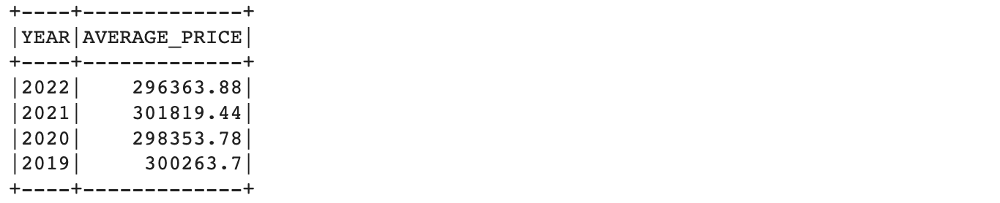
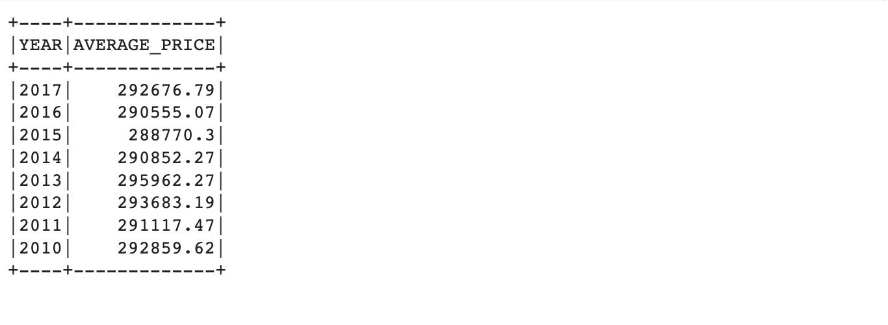
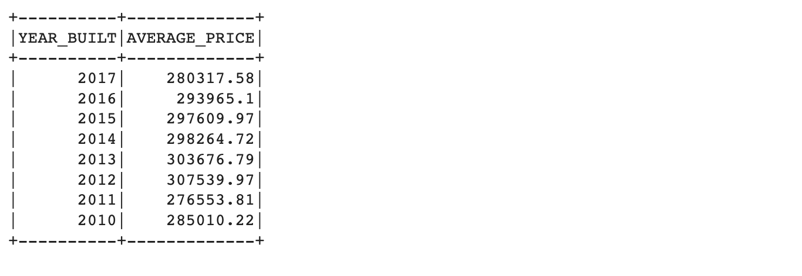
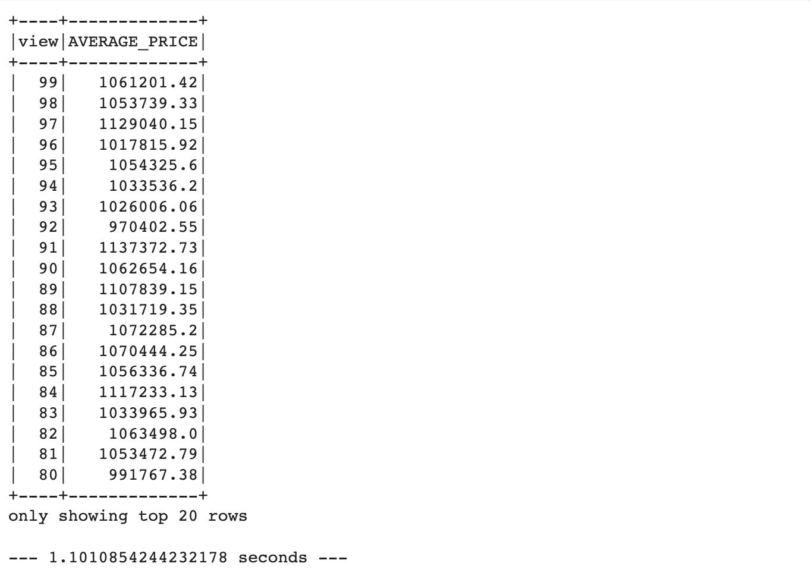

# Home_Sales

## Background

In this challenge, I will be applying my knowledge of SparkSQL to determine key metrics about home sales data. Then I will use Spark to create temporary views, partition the data, cache and uncache a temporary table, and verify that the table has been uncached.

## Questions

* What is the average price for a four-bedroom house sold for each year? Round off your answer to two decimal places.

* What is the average price of a home for each year it was built that has three bedrooms and three bathrooms? Round off your answer to two decimal places.

* What is the average price of a home for each year built that have 3 bedrooms, 3 bathrooms, with two floors,and are greater than or equal to 2,000 square feet rounded to two decimal places?

* What is the "view" rating for homes costing more than or equal to $350,000? Determine the run time for this query, and round off your answer to two decimal places.

## References

* Data for this dataset was generated by edX Boot Camps LLC, and is intended for educational purposes only.

